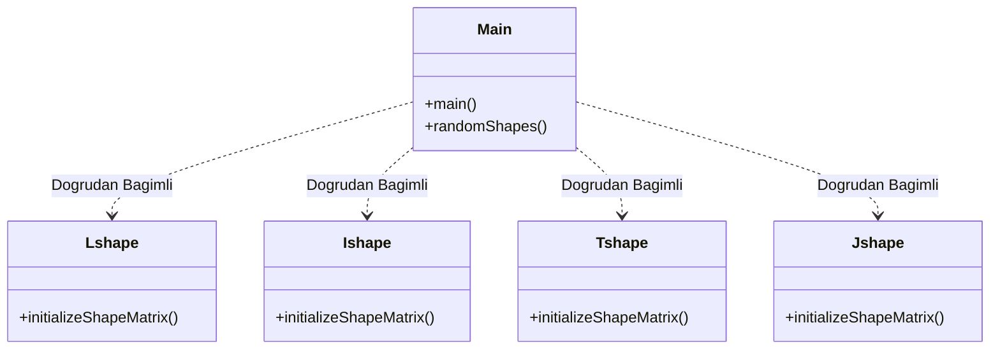
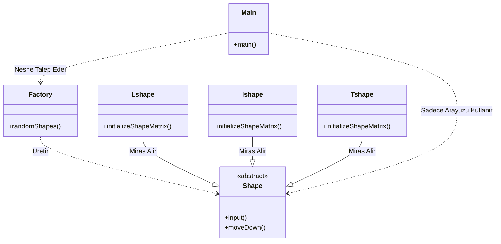
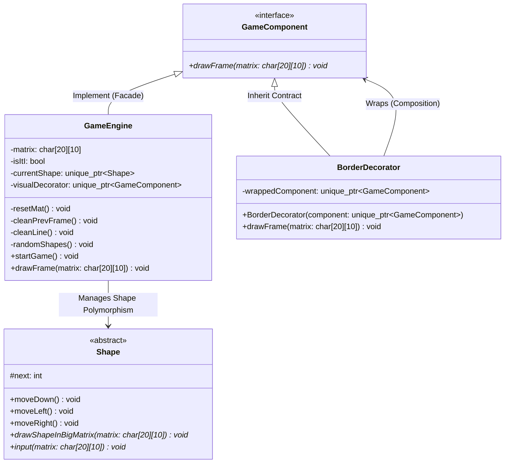

## UML Sınıf Diyagramları (Önce / Sonra)

### 1. Önce (Faz 0 - İlk Durum)

```mermaid
classDiagram
    class Main {
        +main()
        +randomShapes()
    }
    class Lshape {
        +initializeShapeMatrix()
    }
    class Ishape {
        +initializeShapeMatrix()
    }
    class Tshape {
        +initializeShapeMatrix()
    }
    class Jshape {
        +initializeShapeMatrix()
    }

    Main ..> Lshape : Dogrudan Bagimli
    Main ..> Ishape : Dogrudan Bagimli
    Main ..> Tshape : Dogrudan Bagimli
    Main ..> Jshape : Dogrudan Bagimli
```

### 2. Sonra (Faz 1 - Factory Method Sonrası)

```mermaid
classDiagram
    class Main {
        +main()
    }
    class Factory {
        +randomShapes()
    }
    class Shape {
        <<abstract>>
        +input()
        +moveDown()
    }
    class Lshape {
        +initializeShapeMatrix()
    }
    class Ishape {
        +initializeShapeMatrix()
    }
    class Tshape {
        +initializeShapeMatrix()
    }

    Main ..> Factory : Nesne Talep Eder
    Factory ..> Shape : Uretir
    Lshape --|> Shape : Miras Alir
    Ishape --|> Shape : Miras Alir
    Tshape --|> Shape : Miras Alir
    Main ..> Shape : Sadece Arayuzu Kullanir
```
### 3. Sonra (Faz 2 - Facade and Decorator Method Sonrası)

```mermaid
classDiagram
    class GameComponent {
        <<interface>>
        +drawFrame(matrix: char[20][10])* void
    }

    class GameEngine {
        -matrix: char[20][10]
        -isItI: bool
        -currentShape: unique_ptr~Shape~
        -visualDecorator: unique_ptr~GameComponent~
        -resetMat() void
        -cleanPrevFrame() void
        -cleanLine() void
        -randomShapes() void
        +startGame() void
        +drawFrame(matrix: char[20][10]) void
    }

    class BorderDecorator {
        -wrappedComponent: unique_ptr~GameComponent~
        +BorderDecorator(component: unique_ptr~GameComponent~)
        +drawFrame(matrix: char[20][10]) void
    }

    class Shape {
        <<abstract>>
        #next: int
        +moveDown() void
        +moveLeft() void
        +moveRight() void
        +drawShapeInBigMatrix(matrix: char[20][10])* void
        +input(matrix: char[20][10])* void
    }

    GameComponent <|-- GameEngine : Implement (Facade)
    GameComponent <|-- BorderDecorator : Inherit Contract
    BorderDecorator --> GameComponent : Wraps (Composition)
    GameEngine --> Shape : Manages Shape Polymorphism
```
